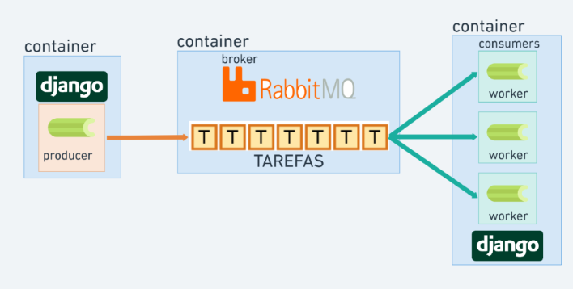

# Sistema de Gerenciamento de Estacionamento

<p align="center">
  
  
  
  
  
  
  
</p>

Um sistema completo de gerenciamento de estacionamento desenvolvido com Django REST Framework que permite controlar veículos, clientes, vagas e registros de entrada/saída, com notificações automáticas e integração via API.

## 📑 Índice

- [Sobre o Projeto](#-sobre-o-projeto)
- [Funcionalidades](#-funcionalidades)
- [Arquitetura](#-arquitetura)
- [Tecnologias](#-tecnologias)
- [Como Executar](#-como-executar)
- [Endpoints da API](#-endpoints-da-api)

## 🎯 Sobre o Projeto

### Principais Desafios

- Implementação de processamento assíncrono para consulta automática de dados de veículos
- Sistema de notificações via WhatsApp e E-mail em tempo real
- Controle automático de status de vagas (ocupado/livre)
- Integração com APIs externas para autocompletar dados de veículos
- Arquitetura escalável com containerização completa

### Aprendizados

- Implementação de tarefas assíncronas com Celery e RabbitMQ
- Integração com Evolution API para notificações WhatsApp
- Uso de Django Signals para automação de status
- Arquitetura de microsserviços com Docker
- Filtros avançados com RQL (Resource Query Language)
- Documentação automática de API com Swagger

## ⚡ Funcionalidades

### 1. Sistema de Administração Interno

**Controle de Acesso**

- Gerenciamento completo de usuários e permissões
- Sistema de autenticação JWT para API
- Controle granular de acessos por módulo
- Dashboard administrativo com Jazzmin

**Cadastros**

- Gerenciamento de clientes do estacionamento
- Cadastro completo de veículos com validação de placa
- Controle de vagas com numeração e localização
- Registro de entradas e saídas de veículos
- Status automático de vagas (ocupado/livre via Signals)

### 2. API RESTful Completa

**Endpoints de Cadastro**

- CRUD completo para clientes, veículos e vagas
- Registro de entradas e saídas via API
- Autenticação JWT com refresh tokens
- Filtros avançados com RQL
- Paginação e ordenação de resultados

**Portal do Cliente**

- Acesso restrito para clientes visualizarem seus dados
- Histórico de veículos cadastrados
- Registros de entradas e saídas
- Consulta de veículos ativos no estacionamento

**Documentação**

- Documentação interativa com Swagger
- Exemplos de requisições e respostas
- Especificação OpenAPI completa

### 3. Autocompletar Dados de Veículos

**Consulta Automática**

- Busca automática de dados do veículo por placa
- Integração com API externa de consulta
- Processamento assíncrono com Celery
- Preenchimento automático de marca, modelo e ano

### 4. Sistema de Notificações

**WhatsApp (Evolution API)**

- Notificação automática na entrada do veículo
- Notificação automática na saída do veículo
- Mensagens personalizadas por cliente
- Integração via Evolution API

**E-mail (SMTP)**

- Notificação por e-mail nas entradas
- Notificação por e-mail nas saídas
- Templates HTML personalizados
- Envio assíncrono para melhor performance

### 5. Controle Automático de Vagas

**Gerenciamento Inteligente**

- Atualização automática de status via Django Signals
- Marcação de vaga como "ocupada" na entrada
- Liberação automática de vaga na saída
- Validação de disponibilidade em tempo real

## 🏗 Arquitetura



### Estrutura de Microsserviços

O projeto utiliza uma arquitetura distribuída com os seguintes componentes:

**Django + Django REST Framework**

Backend principal da aplicação, responsável por toda a lógica de negócio, validações e endpoints da API. Escolhido por sua robustez, ORM poderoso e ecossistema maduro para desenvolvimento rápido e seguro.

**Celery**

Sistema de filas de tarefas distribuídas para processamento assíncrono. Utilizado para executar tarefas em background como consulta de dados de veículos e envio de notificações, evitando bloqueio das requisições HTTP.

**RabbitMQ**

Message broker que gerencia as filas de tarefas do Celery. Garante entrega confiável de mensagens e permite escalabilidade horizontal do processamento assíncrono.

**PostgreSQL**

Banco de dados relacional principal, escolhido por sua confiabilidade, recursos avançados e excelente performance. Armazena todos os dados de clientes, veículos, vagas e registros.

**Evolution API**

Serviço externo para integração com WhatsApp, permitindo envio de notificações automáticas aos proprietários dos veículos sem necessidade de API oficial do WhatsApp.

**SMTP Server**

Servidor de e-mail para envio de notificações. Configurado para envio assíncrono através do Celery, garantindo que falhas no envio não afetem o fluxo principal da aplicação.

### Módulos da Aplicação

**authentication/**

- Autenticação JWT para API
- Gerenciamento de tokens de acesso e refresh
- Controle de permissões e grupos de usuários

**customers/**

- CRUD completo de clientes
- Validação de dados cadastrais
- Relacionamento com veículos e registros

**vehicles/**

- Gerenciamento de veículos
- Integração com API de consulta de placas
- Autocompletar dados via Celery tasks

**parking/**

- Controle de vagas disponíveis
- Registro de entradas e saídas
- Django Signals para atualização automática de status
- Sistema de notificações integrado

**core/**

- Configurações gerais do projeto
- Settings de ambiente (development/production)
- Configuração de Celery e banco de dados

## 🛠 Tecnologias

**Django 4.2**

Framework web Python de alto nível que promove desenvolvimento rápido e design limpo. Oferece ORM poderoso, sistema de admin robusto e excelente documentação.

**Django REST Framework 3.16**

Toolkit completo para construção de APIs RESTful. Fornece serialização, autenticação, paginação e sistema de permissões out-of-the-box.

**Celery 5.5**

Framework para processamento distribuído de tarefas assíncronas. Permite executar operações demoradas em background sem bloquear requisições web.

**PostgreSQL 17**

Sistema de gerenciamento de banco de dados relacional avançado, com suporte a JSON, full-text search e recursos empresariais.

**RabbitMQ 4.0**

Message broker robusto que implementa AMQP (Advanced Message Queuing Protocol), garantindo entrega confiável de mensagens entre serviços.

**Docker & Docker Compose**

Containerização de todos os serviços para garantir ambiente consistente em desenvolvimento e produção. Orquestração simplificada de múltiplos containers.

**Jazzmin**

Interface administrativa moderna para Django, oferecendo dashboard responsiva para gerenciamento do sistema.

**Flake8**

Linter Python para garantir qualidade de código seguindo padrões PEP 8, mantendo codebase limpo e consistente.

**drf-rql**

Biblioteca para implementar RQL (Resource Query Language) nos endpoints da API, permitindo filtros avançados e flexíveis.

**Swagger/OpenAPI**

Ferramenta de documentação automática da API, gerando interface interativa para testar endpoints e visualizar schemas.

## 🚀 Como Executar

### Pré-requisitos

- Docker instalado
- Docker Compose instalado

### Instalação com Docker (Recomendado)

1. Clone o repositório

```bash
git clone <url-do-repositório>
cd parking-management-system
```

2. Execute o Docker Compose

```bash
docker-compose up -d
```

3. Execute as migrações (primeira vez)

```bash
docker-compose exec web python manage.py migrate
```

4. Crie um superusuário

```bash
docker-compose exec web python manage.py createsuperuser
```

5. Acesse o sistema

- API: `http://localhost:8000/api/`
- Admin: `http://localhost:8000/admin/`
- Swagger: `http://localhost:8000/swagger/`

### Serviços Disponíveis

| Serviço             | URL                           | Porta |
| ------------------- | ----------------------------- | ----- |
| API REST            | http://localhost:8000         | 8000  |
| Admin Django        | http://localhost:8000/admin   | 8000  |
| Swagger Docs        | http://localhost:8000/swagger | 8000  |

## 📡 Endpoints da API

### Autenticação

```
POST   /api/auth/login/          - Login e obtenção de tokens JWT
POST   /api/auth/refresh/        - Renovar token de acesso
POST   /api/auth/logout/         - Logout (invalidar refresh token)
```

### Clientes

```
GET    /api/customers/           - Listar clientes
POST   /api/customers/           - Criar novo cliente
GET    /api/customers/{id}/      - Detalhes de um cliente
PUT    /api/customers/{id}/      - Atualizar cliente
DELETE /api/customers/{id}/      - Deletar cliente
```

### Veículos

```
GET    /api/vehicles/            - Listar veículos
POST   /api/vehicles/            - Cadastrar novo veículo
GET    /api/vehicles/{id}/       - Detalhes de um veículo
PUT    /api/vehicles/{id}/       - Atualizar veículo
DELETE /api/vehicles/{id}/       - Deletar veículo
GET    /api/vehicles/plate/{plate}/ - Buscar por placa (autocompletar)
```

### Vagas

```
GET    /api/parking-spots/       - Listar vagas
POST   /api/parking-spots/       - Criar nova vaga
GET    /api/parking-spots/{id}/  - Detalhes de uma vaga
PUT    /api/parking-spots/{id}/  - Atualizar vaga
DELETE /api/parking-spots/{id}/  - Deletar vaga
GET    /api/parking-spots/available/ - Listar vagas disponíveis
```

### Registros de Estacionamento

```
GET    /api/parking-records/     - Listar registros
POST   /api/parking-records/     - Criar entrada de veículo
GET    /api/parking-records/{id}/ - Detalhes de um registro
PUT    /api/parking-records/{id}/exit/ - Registrar saída
GET    /api/parking-records/active/ - Veículos atualmente no estacionamento
```

**Exemplo de filtros com RQL:**

```
GET /api/vehicles/?filter=customer.name==John
GET /api/parking-records/?filter=entry_date>2024-01-01
```

---
